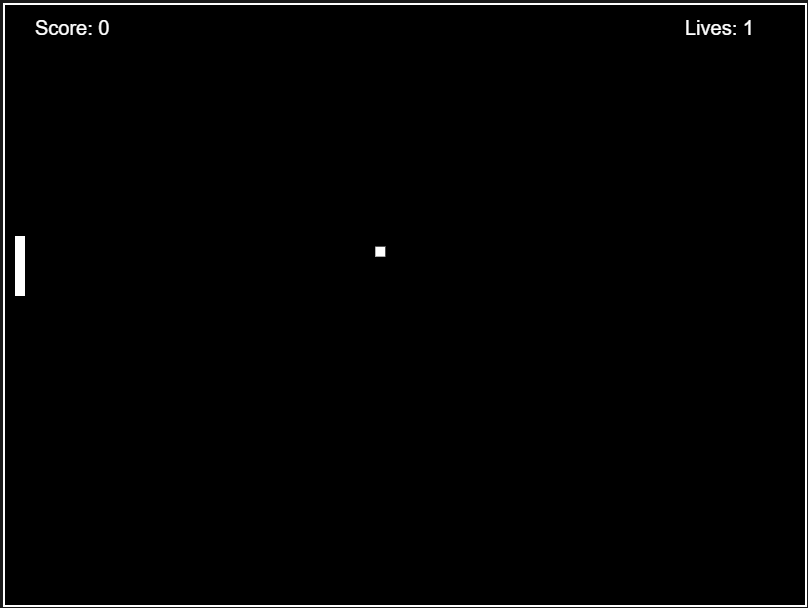

# 🎮 Squash Game

[](https://img.shields.io/badge/github-psaraiva%2F-squash-blue)
[](https://opensource.org/licenses/MIT)

[](https://goreportcard.com/report/github.com/psaraiva/squash)
[](https://codecov.io/gh/psaraiva/squash)
[](./README.md)

Um jogo clássico de Squash desenvolvido em **Go** (TinyGO) e compilado para **WebAssembly (WASM)**, rodando diretamente no navegador sem necessidade de plugins.

---

## 📑 Navegação Rápida

**👾 Para Jogadores:**
- [🕹️ Como Jogar](#️-como-jogar)
- [🎛️ Configurações do Jogo](#️-configurações-via-url)

**👨‍💻 Para Desenvolvedores:**
- [⚙️ Instalação e Execução](#️-instalação-e-execução)
- [🧪 Testes](#-testes)

**🏗️ Para Engenheiros de Software:**
- [📊 Dados Técnicos](#-dados-técnicos) - Arquitetura, Design Patterns e Stack

---

## 📋 Sobre o Jogo

Squash é um jogo arcade onde você controla uma raquete e precisa rebater a bola contra a parede, evitando que ela escape pela lateral esquerda. A cada rebatida bem-sucedida, você ganha pontos e o jogo fica progressivamente mais desafiador.

### 🎬 Preview do Jogo



## 🕹️ Como Jogar

### Objetivo
- Rebater a bola com a raquete
- Evitar que a bola escape pela lateral esquerda
- A cada rebatida, você ganha uma pontuação (**10 pontos**)
- A cada **100 pontos**, você avança de nível e a bola fica mais rápida
- Você tem **3 vidas** inicialmente (padrão)

### Controles

> **Nota**: O jogo requer **mouse** ou **caneta** (stylus) para tablets. Controles touch não são suportados.

- **Mover raquete**: Movimente o mouse (ou caneta) verticalmente
- **Iniciar jogo**: Clique esquerdo
- **Pausar**: Clique direito
- **Reiniciar**: Clique esquerdo (na tela de Game Over)

## 🎛️ Configurações via URL

Você pode personalizar o jogo através de query parameters:

```
http://localhost:8080?debug=true&lives=5&level=10&boost=0.8&ballsize=0.7&fps=60
```

### Parâmetros disponíveis:

| Parâmetro  | Tipo      | Range       | Descrição                                |
|------------|-----------|-------------|------------------------------------------|
| `debug`    | boolean   | true/false  | Ativa modo debug com informações         |
| `lives`    | int       | 1 - 99      | Número inicial de vidas                  |
| `level`    | int       | 0 - 50      | Nível inicial do jogo                    |
| `boost`    | float     | 0.0 - 1.0   | Incremento de velocidade por nível       |
| `ballsize` | float     | 0.0 - 1.0   | Escala do tamanho da bola                |
| `fps`      | int       | 30 ou 60    | Frames por segundo (taxa de atualização) |

---

## ⚙️ Instalação e Execução

<details>
<summary><b>📦 Pré-requisitos e Instalação</b> (clique para expandir)</summary>

### Pré-requisitos

**Opção 1: Execução Local**
- Go 1.23+
- TinyGo (para compilar para WASM)

**Opção 2: Execução com Docker**
- Docker instalado

### Instalação

```bash
# Clone o repositório
git clone https://github.com/psaraiva/squash.git
cd squash
```

### Build e Execução

#### 🐳 **Opção 1: Docker (Recomendado)**

```bash
# Build e executa em um único comando
make docker-deploy
```

Acesse: `http://localhost:8080`

**Comandos Docker disponíveis:**

```bash
make docker-build    # Constrói a imagem Docker
make docker-run      # Executa o container
make docker-stop     # Para e remove o container
make docker-clean    # Remove container e imagem
```

#### 💻 **Opção 2: Execução Local**

Requer Go 1.23+ e TinyGo instalados.

```bash
# Instale as dependências
go mod download

# Build e inicia o servidor local
make web-deploy-local

# Ou execute os comandos separadamente:
make web-build        # Compila para WASM
make web-serve-start  # Inicia servidor HTTP
```

Acesse: `http://localhost:8080`

**Limpeza:**

```bash
make web-clean  # Remove arquivos compilados (local)
```

</details>

<details>
<summary><b>🧪 Testes</b> (clique para expandir)</summary>

```bash
# Executar todos os testes com cobertura
make go-test-all

# Executar apenas testes unitários
make go-test

# Executar apenas testes WASM
make go-test-wasm

# Gerar mocks das interfaces
make go-mock
```

**Cobertura:** 100% dos statements testados

</details>

---

## 🏗️ Dados Técnicos

> **Para engenheiros de software**: Este projeto demonstra **Clean Architecture** e **Hexagonal Architecture (Ports & Adapters)** em Go com WebAssembly, 100% testável e extensível.

<details open>
<summary>🎯 <b>Características Técnicas</b> (resumo)</summary>

- 🌐 Roda no navegador via WebAssembly
- 🎮 Controle via **mouse** ou **caneta** (não suporta touch)
- 🎚️ Sistema de níveis progressivos com aumento de dificuldade
- 🎨 Interface limpa e responsiva  
- 🐛 Modo debug para desenvolvedores
- ⚙️ Configurações personalizáveis via query string
- ✅ **100% cobertura de testes**

</details>

<details>
<summary>🚀 <b>Stack Tecnológica</b> (clique para expandir)</summary>

### Core
- **Go 1.23** - Linguagem de programação principal
- **TinyGo** - Compilador otimizado para WebAssembly
- **WebAssembly (WASM)** - Tecnologia para executar código Go no navegador
- **JavaScript** - Integração com APIs do navegador via `syscall/js`

### Arquitetura
- **Clean Architecture** - Separação clara de camadas (domain, ports, adapters)
- **Hexagonal Architecture** - Ports & Adapters pattern
- **Dependency Injection** - Interfaces para desacoplamento
- **Strategy Pattern** - Estratégia de input via mouse

### Testes
- **Go Testing** - Framework nativo de testes
- **Custom Mocks** - Implementação própria sem dependências externas
- **Table-Driven Tests** - Padrão de testes recomendado pelo Go
- **TinyGo Test** - Testes compatíveis com WASM target

### Desenvolvimento
- **Make** - Automação de build e deploy
- **Docker** - Containerização com multi-stage build
- **Go Modules** - Gerenciamento de dependências

</details>

<details>
<summary>🏗️ <b>Estrutura do Projeto</b> (clique para expandir)</summary>

```
squash/
├── cmd/                  # Entry points (interfaces de entrega)
│   └── wasm/             # Implementação WebAssembly
│       ├── main.go       # Wire-up e inicialização
│       └── index.html    # Interface HTML
│
├── internal/             # Core do domínio (lógica de negócio)
│   ├── app/              # Motor do jogo e regras de negócio
│   │   ├── config.go     # Configurações e valores padrão
│   │   ├── engine.go     # Física e mecânicas do jogo
│   │   └── game.go       # Estado e entidades do jogo
│   │
│   └── ports/            # Contratos/Interfaces
│       ├── config.go     # Interface ConfigProvider
│       ├── renderer.go   # Interface Renderer
│       └── mocks/        # Mocks gerados
│
├── pkg/                  # Código reutilizável (infraestrutura)
│   └── adapters/         # Implementações dos ports
│       ├── input/        # Input adapters
│       │   ├── wasm/     # Config loader WASM
│       │   └── web/      # UI e renderização
│       └── output/       # Output adapters  
│           └── web/      # Canvas renderer
│
└── bin/                  # Artefatos compilados
    └── web/              # Assets do WASM
```

</details>

<details>
<summary>📊 <b>Arquitetura e Design Patterns</b> (clique para expandir)</summary>

Este projeto foi desenvolvido seguindo os princípios de **Clean Architecture** e **Hexagonal Architecture (Ports & Adapters)**, tornando o código altamente testável, manutenível e extensível para diferentes plataformas.

### 🎯 Camadas da Arquitetura

#### 1. **Core Domain** (`internal/app/`)
- **Responsabilidade**: Lógica de negócio pura, regras do jogo, física
- **Arquivos**: `engine.go` (física e mecânicas), `game.go` (estado), `config.go`
- **Independente**: Não conhece detalhes de infraestrutura (Web, CLI, etc)
- **Testável**: 100% testável sem dependências externas

#### 2. **Ports** (`internal/ports/`)
- **Responsabilidade**: Contratos/interfaces que o domínio espera
- **Interfaces**: `ConfigProvider`, `Renderer`
- **Inversão de Dependência**: Domínio define, adapters implementam

#### 3. **Adapters** (`pkg/adapters/`)
- **Responsabilidade**: Implementações concretas dos ports
- **Input Adapters**:
  - `input/wasm/config_loader.go` - Lê config da query string
  - `input/wasm/handler.go` - Captura eventos de mouse
  - `input/web/ui.go` - Lógica de renderização UI
- **Output Adapters**:
  - `output/web/canvas.go` - Renderer Canvas 2D
  - `output/web/jscontext.go` - Wrapper para syscall/js
- **Intercambiável**: Fácil trocar implementações sem afetar o core

#### 4. **Entry Points** (`cmd/`)
- **Responsabilidade**: Composição (wire-up) e inicialização
- **Mínimo de lógica**: Apenas instancia e conecta componentes

### 🔌 Extensibilidade: Novas Implementações

A arquitetura permite criar facilmente novas versões do jogo para diferentes plataformas:

#### 🖥️ **Exemplo: New Version (CLI)**
```
cmd/new/
  └── main.go                    # Entry point CLI

pkg/adapters/
  ├── input/new/
  │   ├── config_loader.go       # Lê config de flags/env
  │   └── keyboard.go            # Captura input
  └── output/terminal/
      └── renderer.go            # Renderização
```

**Exemplo de uso:**
```bash
go run cmd/new/main.go --lives=5 --level=10
```

**O core (`internal/app`) permanece 100% inalterado!**

### 🧩 Princípios SOLID Aplicados

| Princípio | Aplicação no Projeto |
|-----------|---------------------|
| **S**RP | Cada package tem uma responsabilidade única |
| **O**CP | Extensível via novos adapters sem modificar o core |
| **L**SP | Interfaces `Renderer`, `ConfigProvider` substituíveis |
| **I**SP | Interfaces pequenas e focadas |
| **D**IP | `internal/app` depende de abstrações (`ports`), não de implementações |

### 🎨 Padrões de Design Utilizados

- **Hexagonal/Ports & Adapters**: Core isolado, adapters conectam infraestrutura
- **Dependency Injection**: Componentes recebem dependências via construtor
- **Strategy Pattern**: Estratégia de input via mouse
- **Factory Pattern**: `NewSquash()`, `NewRenderer()`, `NewConfigLoader()`
- **Template Method**: `Renderer.Render()` com implementações específicas

### ✨ Benefícios da Arquitetura

✅ **Testabilidade**: Core testável sem mocks complexos (100% cobertura)  
✅ **Manutenibilidade**: Mudanças isoladas em camadas específicas  
✅ **Reutilização**: Lógica do jogo reutilizável em qualquer plataforma  
✅ **Evolução**: Fácil adicionar features sem quebrar código existente  
✅ **Independência**: Core não depende de frameworks externos  
✅ **Portabilidade**: Mesmo core para Web, CLI, Mobile, Desktop

</details>

---

## 📝 Licença

Este projeto é de código aberto e está disponível sob a licença MIT.

## 👨‍💻 Autor

Desenvolvido por [@psaraiva](https://github.com/psaraiva)

---

**Divirta-se jogando! 🎉**
